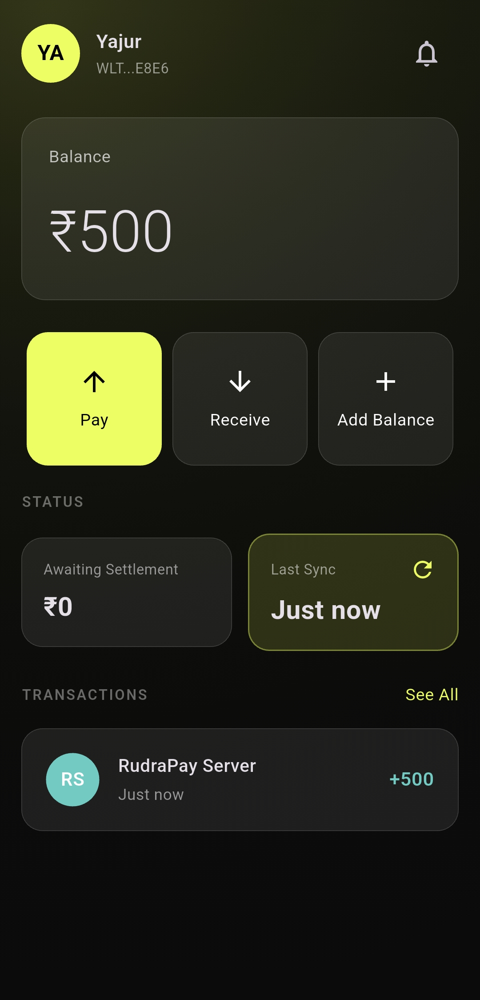
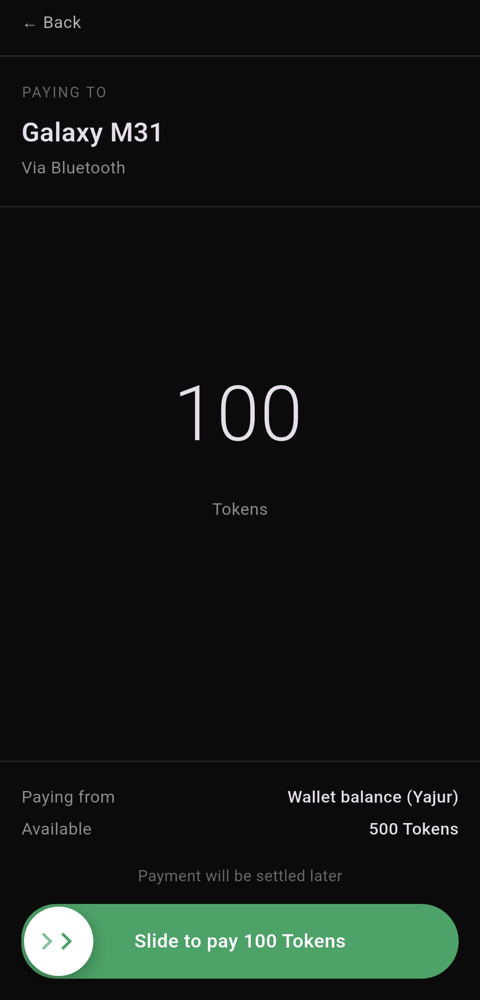
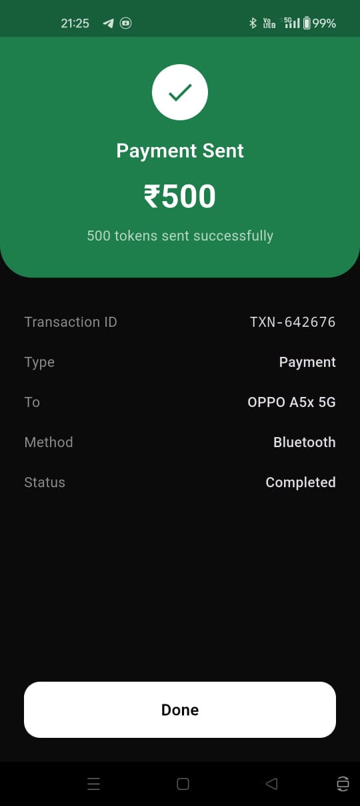
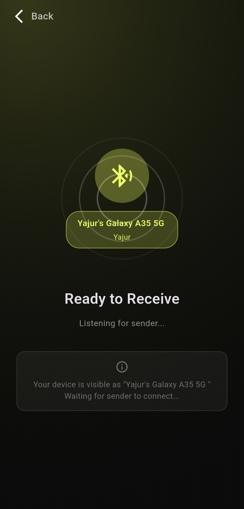
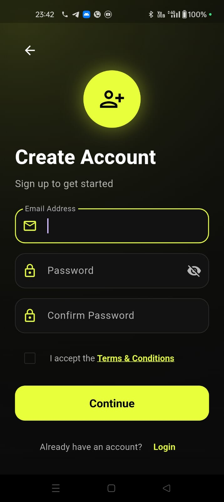

# OPay - Offline Digital Wallet System

---


<div align="center">


**A comprehensive offline-first digital wallet application with Bluetooth P2P payments**

[](https://flutter.dev)
[](https://nodejs.org)
[](https://www.bluetooth.com)
[](LICENSE)

</div>

---

## 📋 Table of Contents

- [Overview](#overview)
- [Features](#features)
- [Architecture](#architecture)
- [Tech Stack](#tech-stack)
- [Project Structure](#project-structure)
- [Getting Started](#getting-started)
- [API Documentation](#api-documentation)
- [Mobile App Guide](#mobile-app-guide)
- [Bluetooth Protocol](#bluetooth-protocol)
- [Security Features](#security-features)
- [Contributing](#contributing)
- [Team](#team)
- [License](#license)

---

## 🌟 Overview

OPay is an innovative **offline-first digital wallet** that enables peer-to-peer token transfers using **Classic Bluetooth (RFCOMM)** without requiring an internet connection. The system consists of a Flutter mobile application and a Node.js backend API for token generation and validation.

## 🧪 Download APK (Beta)

> ⚠️ Beta release — for testing only. Expect bugs and unfinished flows.

🔽 **Download OPay Beta APK**  
👉 [OPay-Beta.apk](https://drive.google.com/file/d/1HGYHOmIIpPmImC7Thpgb7IrmsjIGAhYF/view)

**Notes**
- Android only (Bluetooth needs real devices)  
- Enable “Install from unknown sources”  
- Use this build for testing — not production
  
### Key Innovation

- **🔄 Offline Payments**: Transfer digital tokens via Bluetooth without internet
- **🔐 Secure Tokens**: Each token has cryptographic signatures for validation
- **⚡ Atomic Transactions**: All-or-nothing transfers with automatic rollback
- **🚫 Double-Spend Prevention**: Token locking mechanism during transfers
- **🔄 Eventual Consistency**: Transactions settle when devices sync online

---

## 📸 App Screenshots

<p align="center">
  
  
  
</p>

<p align="center">
  
  
  
</p>

<p align="center">
  <i>Home • Enter Amount • Confirm • Bluetooth Scan • Ready to Receive • Create Account</i>
</p>


## ✨ Features

### 🏦 Digital Wallet Core
- **Token-based balance system** with cryptographic signatures
- **Add balance/recharge** functionality via API
- **Transaction history** with unsettled/settled states
- **Balance protection** with UI enforcement
- **Secure local storage** using SharedPreferences

### 📡 Bluetooth P2P Payments
- **Device discovery** and pairing via Classic Bluetooth
- **Peer-to-peer transfers** without internet connectivity
- **Message fragmentation** handling for large transfers
- **Real-time balance updates** across multiple screens
- **Transaction cancellation** with proper cleanup

### 🔒 Security & Reliability
- **Double-spend prevention** through token locking
- **Atomic transactions** with automatic reversion on failure
- **Cryptographic token signatures** for server validation
- **Unique transaction IDs** generated from transaction details
- **Error handling** with comprehensive rollback mechanisms

### 🎨 User Experience
- **Intuitive UI/UX** with Material Design
- **Real-time feedback** during transfers
- **Confirmation dialogs** for critical actions
- **Loading states** and progress indicators
- **Error messages** with actionable guidance

---

## 🏗️ Architecture

### System Design

```
┌─────────────────────────────────────────────────────────────┐
│                    OPay System                          │
└─────────────────────────────────────────────────────────────┘

┌─────────────────────┐                    ┌─────────────────────┐
│    Flutter App      │                    │    Flutter App      │
│     (Device A)      │                    │     (Device B)      │
│                     │                    │                     │
│  ┌───────────────┐  │                    │  ┌───────────────┐  │
│  │ Presentation  │  │                    │  │ Presentation  │  │
│  │    Layer      │  │                    │  │    Layer      │  │
│  └───────────────┘  │                    │  └───────────────┘  │
│  ┌───────────────┐  │                    │  ┌───────────────┐  │
│  │   Service     │  │                    │  │   Service     │  │
│  │    Layer      │  │                    │  │    Layer      │  │
│  └───────────────┘  │                    │  └───────────────┘  │
│  ┌───────────────┐  │                    │  ┌───────────────┐  │
│  │    Local      │  │                    │  │    Local      │  │
│  │   Storage     │  │                    │  │   Storage     │  │
│  └───────────────┘  │                    │  └───────────────┘  │
└─────────────────────┘                    └─────────────────────┘
           │                                          │
           │              Bluetooth RFCOMM            │
           └──────────────────────────────────────────┘
                                │
                                │ HTTP/REST API
                                │ (When Online)
                                ▼
                    ┌─────────────────────┐
                    │    Node.js API      │
                    │                     │
                    │  ┌───────────────┐  │
                    │  │ Token         │  │
                    │  │ Generator     │  │
                    │  └───────────────┘  │
                    │  ┌───────────────┐  │
                    │  │ Validation    │  │
                    │  │ Service       │  │
                    │  └───────────────┘  │
                    └─────────────────────┘
```

### Data Flow

```
┌─────────────┐    1. Recharge Request     ┌─────────────┐
│   Mobile    │ ──────────────────────────> │   Node.js   │
│     App     │                             │     API     │
│             │ <────────────────────────── │             │
└─────────────┘    2. Tokens Generated     └─────────────┘
       │
       │ 3. Store Tokens Locally
       ▼
┌─────────────┐    4. Bluetooth Transfer   ┌─────────────┐
│   Device A  │ ──────────────────────────> │   Device B  │
│  (Sender)   │                             │ (Receiver)  │
│             │ <────────────────────────── │             │
└─────────────┘    5. Confirmation         └─────────────┘
       │                                           │
       │ 6. Update Local Balance                   │ 7. Update Local Balance
       ▼                                           ▼
┌─────────────┐                             ┌─────────────┐
│   Local     │                             │   Local     │
│  Storage    │                             │  Storage    │
└─────────────┘                             └─────────────┘
```

---

## 🛠️ Tech Stack

### Frontend (Mobile App)
- **Framework**: Flutter 3.x (Dart)
- **State Management**: Provider Pattern
- **Storage**: SharedPreferences
- **Bluetooth**: Classic Bluetooth RFCOMM
- **UI**: Material Design 3

### Backend (API)
- **Runtime**: Node.js
- **Framework**: Express.js
- **Cryptography**: Node.js Crypto module
- **Token Generation**: UUID + SHA-256 signatures

### Communication
- **Offline**: Classic Bluetooth (RFCOMM)
- **Online**: HTTP/REST API
- **Data Format**: JSON
- **Protocol**: Custom message protocol with fragmentation support

---

## 📁 Project Structure

```
OPay/
├── OPay-App-main/              # Flutter Mobile Application
│   ├── lib/
│   │   ├── core/                   # Core services and utilities
│   │   │   ├── services/           # Bluetooth, storage services
│   │   │   └── utils/              # Helper functions
│   │   ├── features/               # Feature-based modules
│   │   │   ├── auth/               # Authentication
│   │   │   ├── balance/            # Wallet balance management
│   │   │   ├── bluetooth/          # Bluetooth functionality
│   │   │   ├── home/               # Home dashboard
│   │   │   └── payment/            # Payment flows
│   │   └── main.dart               # App entry point
│   ├── android/                    # Android-specific files
│   ├── ios/                        # iOS-specific files
│   ├── web/                        # Web-specific files
│   ├── windows/                    # Windows-specific files
│   ├── linux/                      # Linux-specific files
│   ├── macos/                      # macOS-specific files
│   └── pubspec.yaml                # Flutter dependencies
│
├── wallet-api-main/                # Node.js Backend API
│   ├── utils/
│   │   └── tokenGenerator.js       # Token generation utility
│   ├── server.js                   # Main server file
│   └── package.json                # Node.js dependencies
│
├── hackathon-blog.md               # Hackathon experience blog
└── README.md                       # This file
```

---

## 🚀 Getting Started

### Prerequisites

- **Flutter SDK** (3.0 or higher)
- **Node.js** (16.0 or higher)
- **Android Studio** / **Xcode** (for mobile development)
- **Physical Android devices** (Bluetooth testing requires real devices)

### Backend Setup

1. **Navigate to API directory**:
   ```bash
   cd wallet-api-main
   ```

2. **Install dependencies**:
   ```bash
   npm install
   ```

3. **Start the server**:
   ```bash
   npm start
   ```

4. **Verify API is running**:
   ```bash
   curl http://localhost:5000
   # Response: "Wallet API is running 🚀"
   ```

### Mobile App Setup

1. **Navigate to app directory**:
   ```bash
   cd OPay-App-main
   ```

2. **Install Flutter dependencies**:
   ```bash
   flutter pub get
   ```

3. **Run on device**:
   ```bash
   # For Android
   flutter run -d android
   ```

### Permissions Setup

#### Android (`android/app/src/main/AndroidManifest.xml`)
```xml
<uses-permission android:name="android.permission.BLUETOOTH" />
<uses-permission android:name="android.permission.BLUETOOTH_ADMIN" />
<uses-permission android:name="android.permission.BLUETOOTH_SCAN" />
<uses-permission android:name="android.permission.BLUETOOTH_CONNECT" />
<uses-permission android:name="android.permission.ACCESS_FINE_LOCATION" />
```

## 📡 API Documentation

### Base URL
```
http://localhost:5000
```

### Endpoints

#### 1. Health Check
```http
GET /
```

**Response**:
```json
"Wallet API is running 🚀"
```

#### 2. Recharge Wallet
```http
POST /api/wallet/recharge
```

**Request Body**:
```json
{
  "userId": "user123",
  "amount": 100
}
```

**Response**:
```json
{
  "success": true,
  "message": "Recharge successful",
  "userId": "user123",
  "totalTokens": 100,
  "tokens": [
    {
      "tokenId": "1d21ee67-161a-4ee7-8d90-c7e78e6f9a24",
      "value": 1,
      "used": false,
      "signature": "4cc9b42f436b6f9af8d05b28cd2bb67de7424ff398e22c1d4fbfbc544de4fd2d",
      "createdAt": "2025-12-30T02:00:38.947Z"
    }
    // ... 100 total tokens
  ]
}
```

**Error Response**:
```json
{
  "success": false,
  "message": "Valid amount is required"
}
```

### Token Structure

Each token contains:
- **tokenId**: UUID (unique identifier)
- **value**: Always 1 (single token unit)
- **used**: Boolean (false when generated)
- **signature**: SHA-256 hash of tokenId + userId
- **createdAt**: ISO timestamp

---

## 📱 Mobile App Guide

### Core Features

#### 1. Authentication
- **Sign Up**: Create new account with name and email
- **Login**: Access existing account
- **Profile Management**: Update user information

#### 2. Wallet Management
- **View Balance**: See current token count
- **Add Balance**: Recharge wallet via API
- **Transaction History**: View all transactions (settled/unsettled)

#### 3. Bluetooth Payments

##### Sending Payment
1. **Navigate**: Home → Pay → Bluetooth
2. **Scan**: Discover nearby devices
3. **Connect**: Select receiver device
4. **Amount**: Enter token amount to send
5. **Confirm**: Slide to pay
6. **Wait**: Receiver accepts/rejects
7. **Transfer**: Tokens sent automatically
8. **Complete**: Success/failure screen

##### Receiving Payment
1. **Navigate**: Home → Receive → Bluetooth
2. **Advertise**: Make device discoverable
3. **Connect**: Accept incoming connection
4. **Request**: Review payment request popup
5. **Accept/Reject**: Choose to proceed
6. **Receive**: Tokens transferred automatically
7. **Complete**: Balance updated

### Key Screens

#### Home Dashboard
- Current balance display
- Quick action buttons (Pay/Receive)
- Recent transaction list
- Profile access

#### Payment Flow
- **Enter Amount**: Amount input with balance validation
- **Device Selection**: Bluetooth device picker
- **Transfer Pending**: Progress indicator with cancellation
- **Success/Failure**: Result confirmation

#### Receive Flow
- **Bluetooth Setup**: Start advertising
- **Connection Status**: Show connected device
- **Payment Request**: Accept/reject popup
- **Receiving**: Progress with cancellation option

---

## 🔄 Bluetooth Protocol

### Message Types

#### 1. Payment Request
```json
{
  "type": "payment_request",
  "txnId": "txn_abc123def456",
  "amount": 567,
  "senderName": "John Doe",
  "timestamp": "2025-12-30T15:30:00.000Z"
}
```

#### 2. Payment Response
```json
{
  "type": "payment_response",
  "status": "accepted",  // or "rejected"
  "txnId": "txn_abc123def456",
  "receiverName": "Jane Smith"
}
```

#### 3. Token Transfer
```json
{
  "type": "token_transfer",
  "txnId": "txn_abc123def456",
  "amount": 567,
  "tokens": [/* array of token objects */]
}
```

#### 4. Transfer Complete
```json
{
  "type": "transfer_complete",
  "txnId": "txn_abc123def456",
  "status": "success"
}
```

### Transfer Flow

```
Sender                          Receiver
  │                                │
  │──── payment_request ──────────>│
  │                                │ (Show popup)
  │<──── payment_response ─────────│
  │                                │
  │──── token_transfer ───────────>│
  │                                │ (Verify & store)
  │<──── transfer_complete ────────│
  │                                │
  │         SUCCESS                │
```

### Message Fragmentation

For large transfers (>5 tokens), messages are automatically fragmented:

1. **Sender**: Sends large JSON in chunks
2. **Receiver**: Buffers chunks until complete
3. **Assembly**: Uses brace counting to detect completion
4. **Processing**: Decodes complete JSON message

---

## 🔐 Security Features

### 1. Token Security
- **Cryptographic Signatures**: SHA-256 hash of tokenId + userId
- **Unique Identifiers**: UUID for each token
- **Server Validation**: Signatures verified when online

### 2. Double-Spend Prevention
- **Token Locking**: Tokens locked during transfer
- **Atomic Transactions**: All-or-nothing transfers
- **Automatic Reversion**: Failed transfers unlock tokens

### 3. Transaction Integrity
- **Unique Transaction IDs**: Generated from transaction details
- **Unsettled Tracking**: Local storage until server confirmation
- **Verification**: Token count and signature validation

### 4. Communication Security
- **Bluetooth Pairing**: Device-level security
- **Message Integrity**: JSON structure validation
- **Error Handling**: Comprehensive failure recovery

---

## 🧪 Testing

### Prerequisites
- **Two physical devices** (Bluetooth testing requires real hardware)
- **Bluetooth enabled** on both devices
- **Location permissions** granted

## 🤝 Contributing

### Development Setup

1. **Fork the repository**
2. **Create feature branch**: `git checkout -b feature/amazing-feature`
3. **Make changes** and test thoroughly
4. **Commit changes**: `git commit -m 'Add amazing feature'`
5. **Push to branch**: `git push origin feature/amazing-feature`
6. **Open Pull Request**

## 🙏 Acknowledgments

- **Flutter Team** for the amazing cross-platform framework
- **Node.js Community** for robust backend tools
- **Bluetooth SIG** for the communication protocol
- **Hackathon Organizers** for the opportunity to innovate

---

<div align="center">

**Built with ❤️ by Team MUDRA**

*Revolutionizing digital payments through offline-first technology*

</div>
